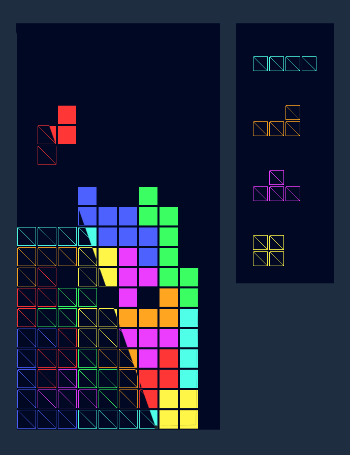

# BlocksGL
A Tetris clone using OpenGL'

</img>

<h3>Usage:</h3> 

Navigate to the releases section and download blocksgl.zip. Unzip it, then run the jar. If the jar doesn't run by clicking on it, run it in console
  by navigating to the same directory the jar is in and typing "java -jar blocksgl.jar". <b>Make sure you unzip the file first before running the jar,
  otherwise the resources will not load.</b>

<h3> Features </h3>
<ul>
  <li>A Batch rendering system</li>
  <li>Fully functional classic Tetris</li>
  <li>Rotations implemented adhering to the Symmetric Rotation System</li>
  <li>Wall kicks</li>
  <li>T-Spin</li>
  <li>Increased falling shape velocity as score increases</li>
  <li>A visual block queue</li>
  <li>(TO ADD) An in-game score representation</li>
  <li>(TO ADD) Menus with adjustable parameters for in-game features</li>
</ul>

<h3>Notes:</h3>
<ul>
  <li>There is no text in this game yet, so the score is displayed at the top of the screen where the title bar should be. I will wait until I make my OpenGL text renderer library   before adding text such as score and a proper game over instead of the program shutting down when you lose.</li>
</ul>

<h3>Controls:</h3>
<ul>
  <li>W: Rotate</li>
  <li>S: Increase downwards velocity on the shape</li>
  <li>A: Move left</li>
  <li>D: Move right</li>
  <li>M: Quad mode (purely aesthetic, see the demoIimg.PNG)</li>
</ul>
